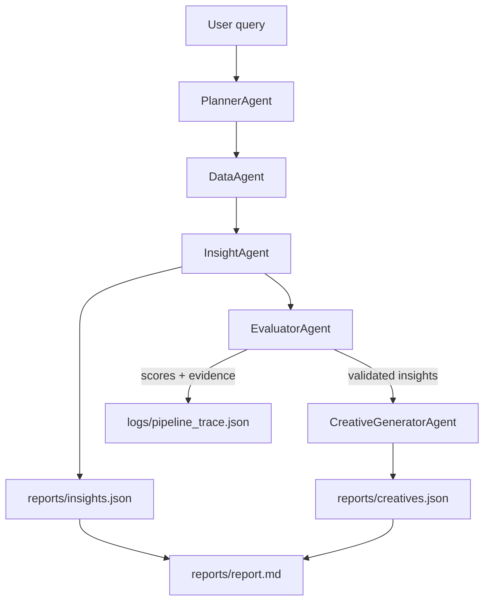

# Agent Graph — Kasparro Agentic Facebook Performance Analyst

This document describes how the agents in the system interact to diagnose ROAS changes and propose creative improvements.

---

## Mermaid Diagram

---

## Agent Roles & Responsibilities

### 1. PlannerAgent
- Converts vague marketer query into clear analytical tasks
- Defines:
  - time windows
  - metrics (ROAS, CTR, CPC, Revenue)
  - segments (campaign, adset, audience, platform)

### 2. DataAgent
- Loads full or sample dataset based on config:
  - `use_sample_data: true` → sample_fb_ads.csv
  - `use_sample_data: false` → synthetic_fb_ads_undergarments.csv
- Applies filters and returns aggregated summaries

### 3. InsightAgent
- Suggests hypotheses explaining ROAS changes, based on summaries
- Structured output with:
  - entity, metric, change direction, possible cause

### 4. EvaluatorAgent
- Quantitatively validates each hypothesis against the dataframe
- Assigns a `confidence` score (0–1)
- Rejects weak / noisy reasoning
- Logs evidence in: `logs/pipeline_trace.json`

### 5. CreativeGeneratorAgent
- Focuses only on segments with validated weak performance (low CTR)
- Generates new creative ideas: headlines, text, CTA, targeting
- Output saved to: `reports/creatives.json`

---

## Outputs and Artifacts

- `reports/insights.json` → validated insights
- `reports/creatives.json` → creative recommendations
- `reports/report.md` → marketer-friendly final summary
- `logs/pipeline_trace.json` → full reasoning trace for evaluation
